# A* Pathfinding Algorithm — C++ Project
 
**Author:** Yi Zheng  
**Programme:** Software & Electronic Engineering, Year 4  
**Institution:** Atlantic Technological University, Galway  
**Module:** C++ Programming  
 
---
 
## Table of Contents
 
1. [Introduction](#introduction)
2. [Research & Background](#research--background)
3. [Project Architecture](#project-architecture)
4. [Step 1 — Point Struct](#step-1--point-struct)
5. [Step 2 — Node Class](#step-2--node-class)
6. [Step 3 — Grid Class](#step-3--grid-class)
7. [Step 4 — AStar Class](#step-4--astar-class)
8. [Step 5 — Testing & Validation](#step-5--testing--validation)
9. [Improvements](#improvements)
   - [Weighted Graphs](#weighted-graphs)
   - [Operator Overloading](#operator-overloading)
10. [Project Management](#project-management)
11. [Reflective Element](#reflective-element)
12. [References](#references)
 
---
 
## Introduction
 
This project is a C++ implementation of the A* (A-star) pathfinding algorithm. A* is one of the most widely used pathfinding algorithms in computer science, commonly found in video games, robotics, and navigation systems. It finds the shortest (or cheapest) path between two points on a grid while navigating around obstacles.
 
The project is built with an object-oriented design using modern C++ (C++17), leveraging STL containers such as `std::vector`, `std::priority_queue`, `std::set`, and `std::array`. The codebase is structured into modular components (Point, Node, Grid, AStar), each with a clear single responsibility.
 
---
 
## Research & Background
 
### The A* Algorithm
 
A* is an informed search algorithm, meaning it uses a heuristic to guide its search towards the goal. It was first described by Peter Hart, Nils Nilsson, and Bertram Raphael of Stanford Research Institute in 1968 in their paper *"A Formal Basis for the Heuristic Determination of Minimum Cost Paths"* [1].
 
The core formula is:
 
```
f(n) = g(n) + h(n)
```
 
Where:
- **f(n)** — the priority score of a given node (n). The algorithm always explores the node with the lowest f.
- **g(n)** — the actual movement cost from the starting point to node (n), accumulated along the path taken.
- **h(n)** — the heuristic estimate of the cost from node (n) to the goal. This is where the "intelligence" of A* comes from.
 
### How It Works
 
A* maintains two data structures:
- **Open List** — nodes discovered but not yet fully explored. The most promising node (lowest f) is always explored first.
- **Closed Set** — nodes that have already been fully explored. This prevents the algorithm from revisiting nodes and going in circles.
 
The algorithm:
1. Start at the start node. Add it to the open list.
2. Pick the node with the lowest f score from the open list.
3. If it is the goal — done. Trace back the path using parent pointers.
4. Otherwise, move it to the closed set.
5. Get its walkable neighbours from the grid.
6. For each neighbour:
   - Skip if already in the closed set.
   - Calculate a tentative g score (current node's g + movement cost).
   - If this is a better path than any previous path to the neighbour:
     - Update g, h, f.
     - Set parent to the current node.
     - Add to the open list.
7. Repeat until the goal is found or the open list is empty.
 
### Why A*?
 
A* is a best-first search algorithm that combines the advantages of Dijkstra's algorithm (guaranteed shortest path) with the speed of greedy best-first search (heuristic guidance). Dijkstra's algorithm is actually a special case of A* where h = 0 for all nodes [2]. The heuristic allows A* to focus its search towards the goal rather than expanding in all directions equally.
 
---
 
## Project Architecture
 
The project follows an object-oriented design with clear separation of concerns. Each class has a single responsibility:
 
```
Point    →  "I am a position"
Node     →  "I am a cell with pathfinding data"
Grid     →  "I know the terrain and who is next to whom"
AStar    →  "I find the best path using Grid and Node"
```
 
### File Structure
 
```
Point.h / Point.cpp       — Position struct and distance functions
Node.h / Node.cpp         — Cell data class for A*
Grid.h / Grid.cpp         — Grid management and neighbour lookup
AStar.h / AStar.cpp       — The pathfinding algorithm
TestAStar.h / TestAStar.cpp — Test cases
main.cpp                  — Entry point
```
 
Each layer depends only on the layers below it. AStar depends on Grid and Node. Grid depends on Node. Node depends on Point. This layered architecture means changes to one component don't ripple through the entire project.
 
---
 
## Step 1 — Point Struct
 
### Design Decision
 
The grid is 2D, so every position requires two coordinates. Without a dedicated type, positions would be passed as pairs of `int`, leading to unclear function signatures and easy mix-ups between x and y.
 
Without Point:
```cpp
int distance(int x1, int y1, int x2, int y2);
```
 
With Point:
```cpp
int distance(const Point& p1, const Point& p2);  // clean, self-documenting
```
 
A struct was chosen over a class because Point is purely data with no complex behaviour — this is a deliberate distinction following C++ conventions.
 
### Implementation
 
**Point.h:**
```cpp
#ifndef POINT_H
#define POINT_H
 
#include <iostream>
 
struct Point {
    int x;
    int y;
 
    bool operator==(const Point& rhs) const {
        return x == rhs.x && y == rhs.y;
    }
 
    bool operator!=(const Point& rhs) const {
        return !(*this == rhs);
    }
};
 
std::ostream& operator<<(std::ostream& os, const Point& p);
int ManhattanDistance(const Point& p1, const Point& p2);
 
#endif
```
 
**Point.cpp:**
```cpp
#include "Point.h"
#include <cmath>
 
int ManhattanDistance(const Point& p1, const Point& p2) {
    return std::abs(p1.x - p2.x) + std::abs(p1.y - p2.y);
}
 
std::ostream& operator<<(std::ostream& os, const Point& p) {
    os << "(" << p.x << ", " << p.y << ")";
    return os;
}
```
 
### Why Manhattan Distance Lives in Point
 
ManhattanDistance takes two Points, reads their x and y, does maths, and returns a number. It has no concept of nodes, grids, or pathfinding. Its entire world is two positions and the distance between them — that is why it belongs with Point.
 
Manhattan distance is the sum of the absolute differences of coordinates. It is called "Manhattan" because it measures distance as if walking along a city grid — only horizontal and vertical moves, no diagonals. For a grid with 4-directional movement, Manhattan distance gives the exact minimum number of steps assuming no obstacles. This makes it an *admissible heuristic* — it never overestimates the true cost, which guarantees A* finds the optimal path [2].

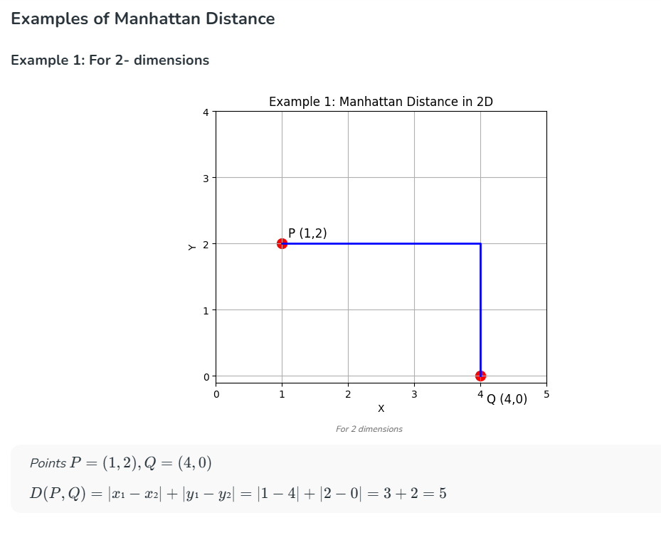
 
### Testing
 
```cpp
Point start = { 0, 0 };
Point goal  = { 4, 4 };
cout << "Manhattan Distance: " << ManhattanDistance(start, goal) << endl;
// Output: Manhattan Distance: 8
```
 
The distance of 8 is correct: |4-0| + |4-0| = 4 + 4 = 8.
 
---
 
## Step 2 — Node Class
 
### Design Decision
 
Each cell in the raw grid is just an `int` (0 or 1). But A* needs to track much more information about each cell as it explores. The Node class wraps a cell with all the data the algorithm needs:
 
1. **pos** (Point) — where is this cell?
2. **walkable** (bool) — can we step on it?
3. **g** (int) — actual cost from start to here
4. **h** (int) — estimated cost from here to goal (ManhattanDistance)
5. **f** (int) — g + h, the score A* uses to decide which cell to explore next
6. **cost** (int) — terrain movement cost (for weighted graphs)
7. **parent** (Node*) — which node did we come from? (for retracing the path)
 
The `parent` pointer is essential. When A* reaches the goal, it needs to answer: "what was the path?" It does this by following parent pointers backwards — goal → previous → previous → ... → start.
 
### Implementation
 
**Node.h:**
```cpp
#ifndef NODE_H
#define NODE_H
 
#include "Point.h"
 
class Node {
public:
    Point pos;
    int g;             // cost from start to this node
    int h;             // heuristic (estimated cost to goal)
    int f;             // total cost: g + h
    int cost;          // terrain cost
    bool walkable;
    Node* parent;
 
    Node();
    Node(Point pos, bool walkable, int cost = 1);
 
    void calculateF();
    bool operator>(const Node& other) const;
};
 
#endif
```
 
**Node.cpp:**
```cpp
#include "Node.h"
 
Node::Node()
    : pos({ 0, 0 }), g(0), h(0), f(0), cost(1), walkable(true), parent(nullptr) {}
 
Node::Node(Point pos, bool walkable, int cost)
    : pos(pos), g(0), h(0), f(0), cost(cost), walkable(walkable), parent(nullptr) {}
 
void Node::calculateF() {
    f = g + h;
}
 
bool Node::operator>(const Node& other) const {
    return f > other.f;
}
```
 
### Key Design Decisions
 
- **Two constructors** — the default `Node()` exists because when we create a 2D vector of Nodes in Grid, the vector needs to default-construct them first before we assign real values. `Node(Point, bool, int)` is used to actually set up each cell.
- **Initialiser lists** — `: pos({0,0}), g(0), ...` sets values as the object is created, rather than creating defaults then overwriting them. This is the preferred C++ approach and is more efficient.
- **`Node* parent`** — a raw pointer, not a copy. Multiple nodes can point to the same parent. The Grid owns all Nodes; parent is just a reference back.
- **`operator>`** — the priority queue in A* needs to compare Nodes. `std::priority_queue` is a max-heap by default, so `operator>` lets us flip it to a min-heap (lowest f on top).
- **`cost = 1`** — the default parameter means existing unweighted code still works. Cells default to cost 1 unless specified otherwise.
- **`nullptr`** — parent starts as null because when a Node is created, it has not been reached by any path yet.
 
---
 
## Step 3 — Grid Class
 
### Design Decision
 
At this point I had two separate things:
1. A raw `vector<vector<int>>` — my map data
2. Node objects — what A* needs to work with
 
Something needed to bridge these two. That is the Grid class.
 
The Grid has three jobs:
1. **Convert** the int grid into a Node grid
2. **Access** a Node by position (with bounds checking)
3. **Find walkable neighbours** — the most important function that A* calls at every step
 
The reason Grid is separated from Node is that a Node only knows about itself. It does not know who is next to it — that depends on the grid layout.
 
### Implementation
 
**Grid.h:**
```cpp
#ifndef GRID_H
#define GRID_H
 
#include "Node.h"
#include <vector>
 
class Grid {
public:
    int rows, cols;
    std::vector<std::vector<Node>> nodes;
 
    Grid(const std::vector<std::vector<int>>& map);
 
    Node* getNode(int x, int y);
    bool isInBounds(int x, int y) const;
    std::vector<Node*> getNeighbors(Node* node);
    void printGrid() const;
    void printPath(const std::vector<Node*>& path) const;
    void printSteps(const std::vector<Node*>& path) const;
 
    friend std::ostream& operator<<(std::ostream& os, const Grid& grid);
};
 
#endif
```
 
**Grid constructor — converting ints to Nodes:**
```cpp
Grid::Grid(const std::vector<std::vector<int>>& map) {
    rows = map.size();
    cols = map[0].size();
 
    nodes.resize(rows);
    for (int i = 0; i < rows; i++) {
        nodes[i].resize(cols);
        for (int j = 0; j < cols; j++) {
            bool walkable = map[i][j] > 0;
            int cost = walkable ? map[i][j] : 0;
            nodes[i][j] = Node(Point{ i, j }, walkable, cost);
        }
    }
}
```
 
The constructor reads the map convention: **0 = obstacle**, any **positive number = walkable with that value as the movement cost**. This convention was a deliberate design decision to support weighted graphs — since each cell now has a cost, using 0 as "path" and 1 as "wall" no longer makes sense.
 
**getNeighbors — the most important function:**
```cpp
std::vector<Node*> Grid::getNeighbors(Node* node) {
    std::vector<Node*> neighbors;
 
    const std::array<int, 4> dx = { -1, 1, 0, 0 };
    const std::array<int, 4> dy = { 0, 0, -1, 1 };
 
    for (size_t i = 0; i < dx.size(); i++) {
        int nx = node->pos.x + dx[i];
        int ny = node->pos.y + dy[i];
 
        if (isInBounds(nx, ny) && nodes[nx][ny].walkable) {
            neighbors.push_back(&nodes[nx][ny]);
        }
    }
 
    return neighbors;
}
```
 
The `dx`/`dy` arrays encode the four directions (up, down, left, right) using `std::array` instead of C-style arrays. For each direction, it calculates the neighbour position, checks it is in bounds and walkable, then includes it. A* relies on this function at every step.
 
Example — neighbours of (2,2) on the grid:
 
```
         (1,2) ← wall? skip
          ↑
(2,1) ← (2,2) → (2,3) ← wall? skip
          ↓
         (3,2) ← walkable ✓
```
 
Only walkable, in-bounds neighbours are returned.
 
---
 
## Step 4 — AStar Class
 
### Design Decision
 
AStar is a utility class — it does not store any data. Both methods are `static`, meaning they can be called directly without creating an AStar object: `AStar::findPath(grid, start, goal)`.
 
**AStar.h:**
```cpp
#ifndef ASTAR_H
#define ASTAR_H
 
#include "Grid.h"
#include "Node.h"
#include <vector>
 
class AStar {
public:
    static std::vector<Node*> findPath(Grid& grid, Point start, Point goal);
 
private:
    static std::vector<Node*> reconstructPath(Node* goal);
};
 
#endif
```
 
- `findPath` returns `vector<Node*>` — the path as pointers to actual Nodes in the Grid. An empty vector means no path was found.
- `reconstructPath` is private — it is an internal helper that only `findPath` calls.
- `Grid& grid` is passed by reference, not const, because A* modifies the Nodes inside (setting g, h, f, parent).
 
### The Algorithm Implementation
 
**reconstructPath — tracing back from goal to start:**
```cpp
std::vector<Node*> AStar::reconstructPath(Node* goal) {
    std::vector<Node*> path;
    Node* current = goal;
 
    while (current != nullptr) {
        path.push_back(current);
        current = current->parent;
    }
 
    std::reverse(path.begin(), path.end());
    return path;
}
```
 
Start at the goal, follow parent pointers back to start (where parent is nullptr). This gives the path in reverse, so `std::reverse` flips it.
 
**findPath — the main algorithm:**
```cpp
std::vector<Node*> AStar::findPath(Grid& grid, Point start, Point goal) {
    Node* startNode = grid.getNode(start.x, start.y);
    Node* goalNode = grid.getNode(goal.x, goal.y);
 
    if (!startNode || !goalNode) {
        std::cout << "Error: start or goal is out of bounds." << std::endl;
        return {};
    }
    if (!startNode->walkable || !goalNode->walkable) {
        std::cout << "Error: start or goal is an obstacle." << std::endl;
        return {};
    }
```
 
First, convert Point coordinates into Node pointers, then validate that start and goal are in bounds and walkable.
 
**The three data structures:**
```cpp
    auto cmp = [](Node* a, Node* b) { return a->f > b->f; };
    std::priority_queue<Node*, std::vector<Node*>, decltype(cmp)> openList(cmp);
 
    std::set<Node*> openSet;
    std::set<Node*> closedSet;
```
 
Each data structure has a distinct purpose:
- **openList** (priority queue) — "give me the node with the lowest f." This is what makes A* efficient.
- **openSet** (set) — "is this node already in the queue?" A priority queue cannot be searched, so we keep a parallel set for fast O(log n) lookups.
- **closedSet** (set) — "has this node already been fully explored?"
 
The lambda `cmp` flips the default max-heap into a min-heap, so the node with the lowest f sits on top. This is why `operator>` was defined in Node.
 
**The main loop:**
```cpp
    while (!openList.empty()) {
        Node* current = openList.top();
        openList.pop();
        openSet.erase(current);
 
        if (current == goalNode) {
            return reconstructPath(goalNode);
        }
 
        closedSet.insert(current);
 
        for (Node* neighbor : grid.getNeighbors(current)) {
            if (closedSet.count(neighbor)) {
                continue;
            }
 
            int tentativeG = current->g + neighbor->cost;
 
            if (!openSet.count(neighbor) || tentativeG < neighbor->g) {
                neighbor->parent = current;
                neighbor->g = tentativeG;
                neighbor->h = ManhattanDistance(neighbor->pos, goalNode->pos);
                neighbor->calculateF();
 
                if (!openSet.count(neighbor)) {
                    openList.push(neighbor);
                    openSet.insert(neighbor);
                }
            }
        }
    }
 
    std::cout << "No path found" << std::endl;
    return {};
}
```
 
The key line is `int tentativeG = current->g + neighbor->cost`. This uses the terrain cost from the weighted graph rather than a hardcoded value of 1. This single change transforms A* from finding the shortest path to finding the cheapest path.
 
---
 
## Step 5 — Testing & Validation
 
Following the testing pattern from the Matrix class project, I created a dedicated `TestAStar.h` / `TestAStar.cpp` with `main.cpp` simply calling `RunTests()`. Each test isolates a specific scenario.
 
### Test Cases
 
**TestBasicPath** — the happy path. Verifies A* finds a valid path on a standard grid with obstacles.
 
Output:

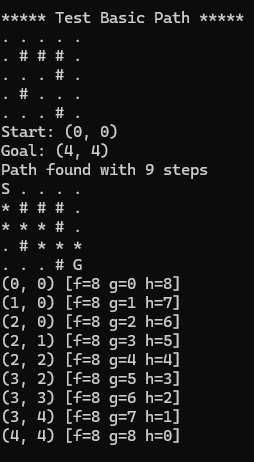
 
**TestNoPath** — a wall completely blocks the grid. A* should exhaust the open list and return empty.

Output:

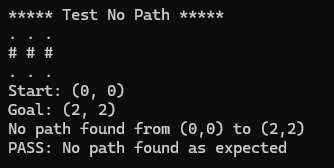
 
**TestStartIsGoal** — an edge case where start equals goal. A* should immediately return a path with one node.

Output:

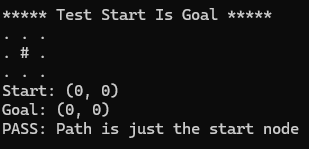
 
**TestOutOfBounds** — goal is set to (5,5) on a 3×3 grid. The validation check should catch this and return empty.

Output:

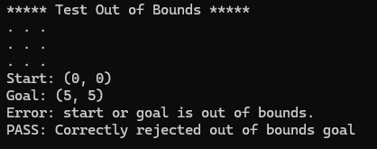
 
**TestStartOnObstacle / TestGoalOnObstacle** — start or goal is placed on a wall. The validation should reject both cases.

Output:

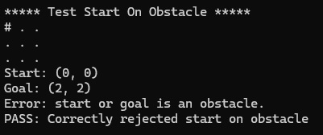

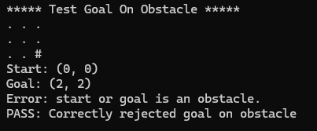
 
**TestLargerGrid** — a 10×10 maze-like grid that forces A* to navigate through winding corridors. Stress tests the algorithm on a more complex map.

Output:

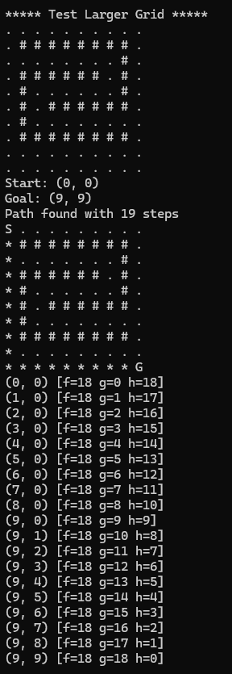
 
**TestWeightedGrid** — tests the weighted graph implementation with terrain costs of 1, 3, and 5.

Output:

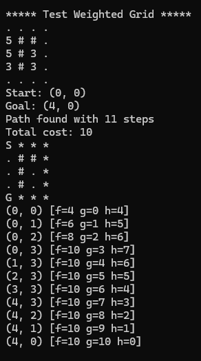
 
---
 
## Improvements

Right now I got the A star working, and I decided to work on some improvements to make the project better.
 
### Weighted Graphs

The first thing I do is to add in the weighted graphs, it is mentioned in the rubric.
 
Right now every step costs 1, a weighted graphs means different terrain has different costs.

Here is my thought, this is an improve that elevates the normal A star from just finding the shortest path, to an algorithm that actually finds the "best" path.

The first thing I think of is applications like google maps, waze. Where they will find the best path, instead of the shortest path, the best path can be differ from various conditions, for example when the traffic is heavy, the algorithm will pick another route, even if it is not the shortest route, but it is the fastest route.

The current algorithm I have, there is no "traffic" on the map, so the algorithm will pick the nearest path using the lowest f cost.

I am thinking of adding a new "traffic" cost, which will change the algorithm from just "f = g + h" into "f = g + h + cost"
So now the algorithm will include the "traffic" cost into consideration in terms of finding the best path.

To apply this new implementation, the first thing I have to do is to add a new **cost** into the **Node Class**.

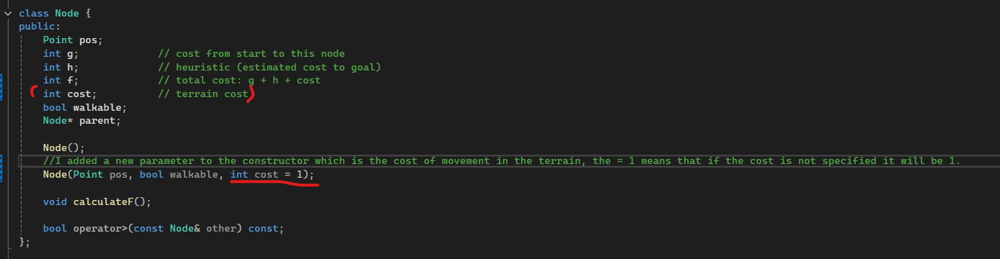

Then I have to update the constructors to include the **cost** field.

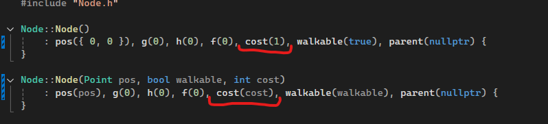

MOving on to the Grid.cpp, I updated the constructor to read the weighs.

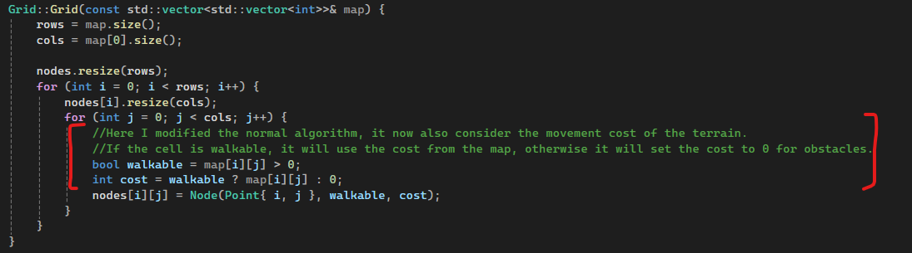

So now it is no longer just tracking if it is walkable, but also it will track the cost to walk to that node.
**BUT there is a change to my original algorithm, in the walkable = map[i][j] > 0, now everything changes into "0 is obstacle, anything greater than 0 is walkable with that value as cost."**
**This is something I need to change in my original tests, since in my original tests I have 0 as path and 1 as obstacle.**

Then lastly in my Astar.cpp, in the findPath function, I updated the **tentativeG** value, the old tentativeG is just the **current g plus 1**, because previously I didn’t have the terrain cost, so each step the g will be just + 1, now after the terrain cost is added, **it will have to add the "cost to that node" instead**.

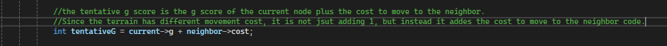

To test this, I added a new test case to test the weighted grid:
 
**Test case — weighted grid:**

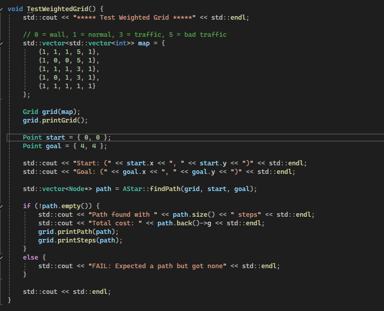
  
**Result:**
```
S * * *
. # # *
. # . *
. # . *
G * * *
Total cost: 10
```
 
The algorithm chose to go right → down → left (11 steps, cost 10) instead of straight down (5 steps, cost 14). Even though the direct route is shorter, it passes through cells costing 5 and 3. The longer route stays entirely on cost-1 cells.
 
Route comparison:
 
| Route | Steps | Cost Breakdown | Total Cost |
|-------|-------|---------------|------------|
| Right → Down → Left (chosen) | 11 | All cost-1 cells: 1×10 | **10** |
| Straight down column 0 | 5 | 5 + 5 + 3 + 1 | **14** |
 
This demonstrates that A* with weights finds the **cheapest** path, not just the shortest.
 
### Operator Overloading
 
Inspired by the Matrix class project from lab, I applied operator overloading to make the code cleaner and more idiomatic C++.
 
**`operator<<` for Point** — instead of manually printing coordinates:
```cpp
// Before:
std::cout << "Start: (" << start.x << ", " << start.y << ")" << std::endl;
 
// After:
std::cout << "Start: " << start << std::endl;
```
 
**`operator<<` for Grid** — using the `friend` keyword pattern from the Matrix project, enabling `std::cout << grid` to replace `grid.printGrid()`.
 
**`operator==` for Point** — enables clean position comparison:
```cpp
if (current->pos == goalNode->pos)  // clear intent
```
 
---
 
## Project Management
 
### Development Timeline
 
| Date | Milestone |
|------|-----------|
| 18/02/2026 | Researched A* algorithm, studied f = g + h formula |
| 19/02/2026 | Implemented Point struct and ManhattanDistance |
| 19/02/2026 | Implemented Node class with constructors and operator> |
| 04/03/2026 | Implemented Grid class (constructor, getNeighbors, display) |
| 11/03/2026 | Implemented AStar class (findPath, reconstructPath) |
| 13/03/2026 | Added weighted graphs, operator overloading, updated tests |
| 18/03/2026 | Added test suite (TestAStar.cpp), exception handling, final polish |
 
### Tools Used
 
- **Visual Studio 2022** — IDE and compiler (C++17)
- **Git / GitHub** — version control and project hosting
- **Claude AI** — used as a learning tool for step-by-step guidance, code explanation, and debugging. All code was typed and understood by hand.
 
---
 
## Reflective Element
 
### Problems Encountered
 
**1. Convention change for weighted graphs.** My original grid used 0 = walkable, 1 = obstacle. When I added weighted graphs, this convention no longer made sense — a cost of 0 for walkable cells is meaningless. I had to switch to 0 = obstacle, positive = cost, and update all existing test cases. This taught me to think ahead about extensibility when choosing data representations.
 
**2. `#include` inside a function body.** When switching from C-style arrays to `std::array`, I accidentally placed `#include <array>` inside the `getNeighbors` function instead of at the top of the file. The compiler dumped the entire library definition inside the function, causing cryptic errors. This reinforced the importance of understanding what `#include` actually does — it is a text replacement directive, not a scoped import.
 
**3. `std::abs` and `constexpr`.** Initially I tried to make ManhattanDistance `constexpr`, but `std::abs` from `<cmath>` is not constexpr in C++17. I learned that constexpr support for standard library functions varies across C++ versions, and chose to use a regular function instead.
 
### What Worked Well
 
- **Step-by-step development** — building Point → Node → Grid → AStar in order, testing each component before moving to the next, prevented cascading bugs.
- **Separation of concerns** — each class has one job. When I added weighted graphs, I only needed to change one line in AStar and a few lines in Grid/Node. The architecture supported the change naturally.
- **Testing pattern from Matrix project** — adopting the RunTests / TestX pattern from the lab project made it easy to add and isolate tests.
 
### What I Would Do Differently
 
- **Plan the weighted graph convention from the start.** If I had anticipated weights, I would have used the 0 = obstacle convention from day one.
- **Add more heuristics.** The rubric mentions extensibility for different heuristics. Adding Euclidean and Chebyshev distance with a `std::function` parameter would demonstrate the Strategy pattern and make the algorithm more flexible.
- **Use `std::unordered_set`** instead of `std::set` for openSet and closedSet. Hash table lookups are O(1) average versus O(log n) for the red-black tree in `std::set`. For larger grids, this would be a meaningful performance improvement.
 
---
 
## References
 
[1] Hart, P.E., Nilsson, N.J. and Raphael, B. (1968) "A Formal Basis for the Heuristic Determination of Minimum Cost Paths", *IEEE Transactions on Systems Science and Cybernetics*, 4(2), pp. 100-107.
 
[2] Wikipedia (2026) *A* search algorithm*. Available at: https://en.wikipedia.org/wiki/A*_search_algorithm (Accessed: 18 March 2026).
 
[3] GeeksforGeeks (2025) *A* Search Algorithm*. Available at: https://www.geeksforgeeks.org/dsa/a-search-algorithm/ (Accessed: 18 February 2026).
 
[4] Patel, A. (2024) *Introduction to A* — Red Blob Games*. Available at: https://www.redblobgames.com/pathfinding/a-star/implementation.html (Accessed: March 2026).
 
[5] Millington, I. (2019) *AI for Games*. 3rd edn. CRC Press.
